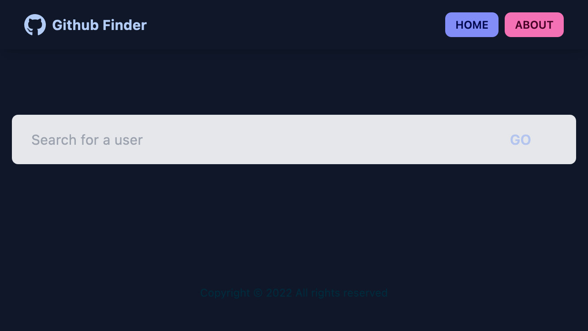
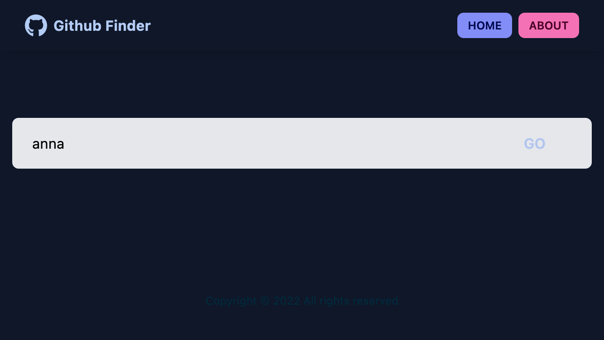
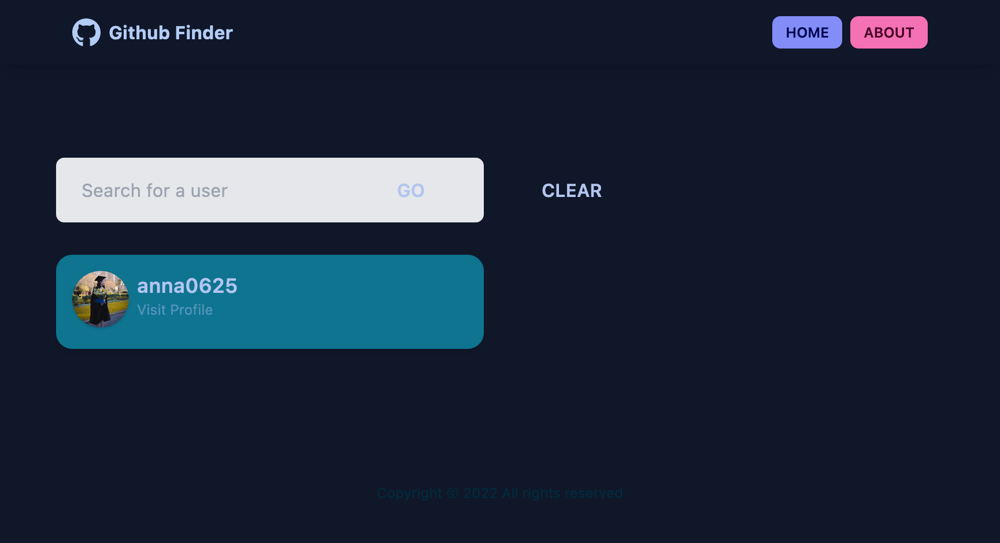
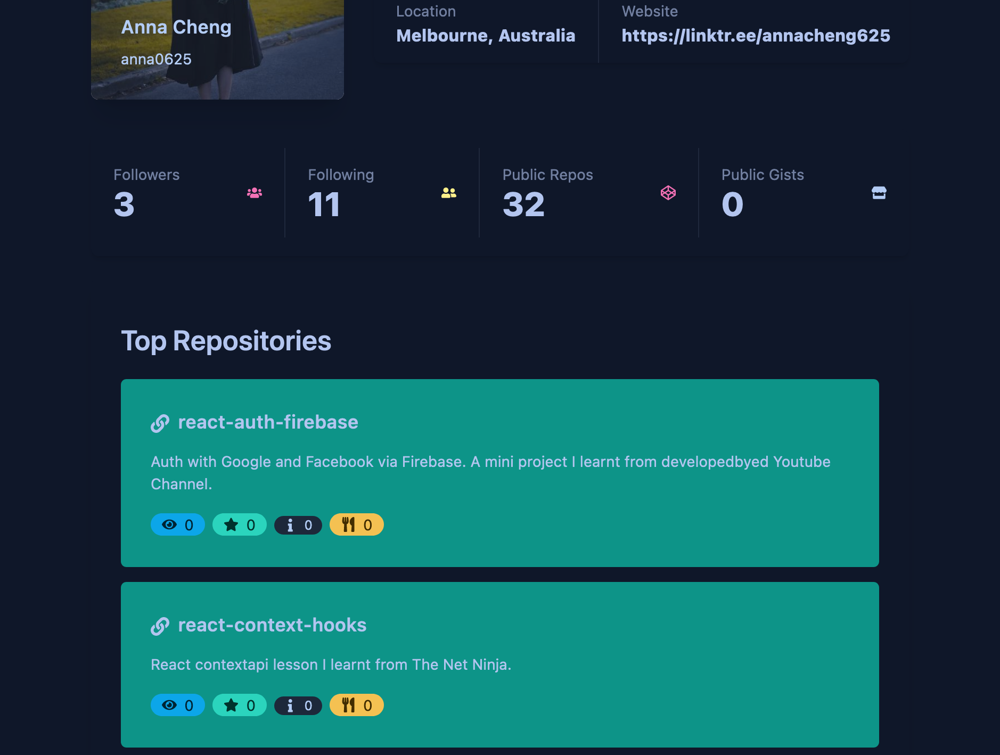

# Github Finder

A course project I learnt from Brad Traversy on Udemy.

The Github API is not working sometimes.  
So I provide the screenshots here.

## Homepage

## Search Results

## Profile

